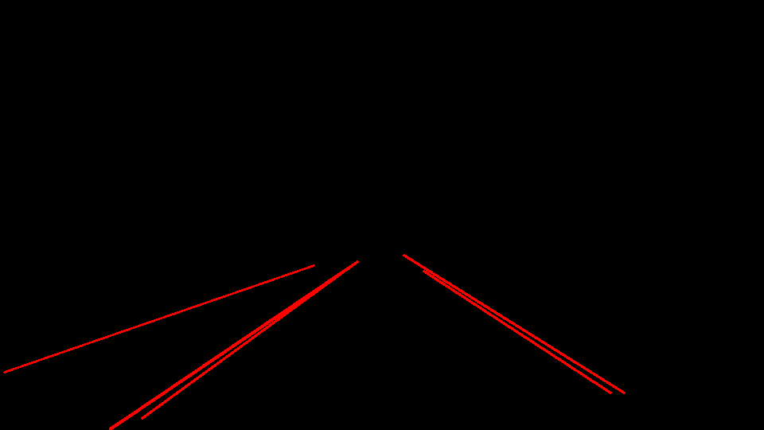
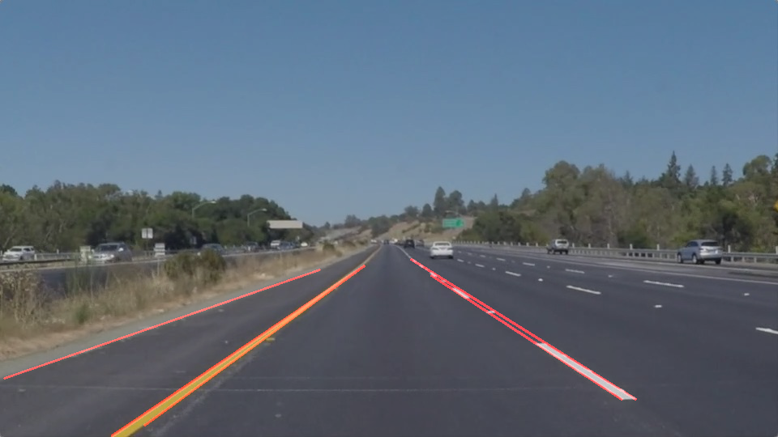

# Line detection with Canny Filter and Hough Transform
*author : nguyenrobot  
*copyright nguyenrobot  
In this tutorial, we use essentially Canny Filter and Hough Transform to detect lines. Why Hough Transform ? With only colour selection, we can not find parameters of detected lines and it's also limited by lines' colour. So, Hough Transformation is here to help us mathematically identify lines on a frame.

Our processing consist of :
- [x] Gaussian filter to favorize Canny edge detection
- [x] Canny edge detection to detect edges, so all of the potential line-candidates
- [x] Zone of interest filtering, to eliminate non-desired detections
- [x] Probabilistic Hough Transform to detect end-points of each detected lines

As you see, we need to find parameters for Gaussian Filter, Canny Edge detection, Hough Transform,... It could work well on a specific image frame but perhaps not on the others, so the tricky part is how to always use good parameters. We will work on this difficult puzzle later. In this tutorial, we just need to understand the basics usages of Canny Filter and Hough Transform.
Furthermore, to detect lane's lines in a curve, more sophisticated technics are needed, they will be mentioned in other tutorials.

*Main script*
line_detection_by_canny_gausian_hough.py  
*Main jupyter notebook*
line_detection_by_canny_gausian_hough.ipynb  
*My previous tutorial on line-detection by colour selection and zone of interest filtering :*
https://github.com/nguyenrobot/line_detection_by_color_zone_interest

### We will work on a road image coming from Udacity <solidYellowLeft.jpg>.
This image is very interesting because it introduces some challenges for our algorithm :
*    A road-edge on the far left side
*    A yellow line on the left
*    A white dashed-line on the right
*    A two more white dashed-lines on the far right side

If our algorithm is robust, it should detect :
*    Left solid-line and right dashed-line of ego-vehicle's lane
*    Road-edge line for the left next-lane
*    Dashed-line for the right next-lane

### Let's see how far can we go...
Image Credit : Udacity &#8595;

#### We convert original image into gray-scale to be able to work with Gaussian Filter and Canny Edge detection
frame_gray &#8595;

#### Gaussian filter makes the image blurred to favorize Canny edge detection
frame_gaussian &#8595;
frame_canny &#8595;

#### Then we apply a zone of interest selection to eliminate non-desired detection
zone_interest &#8595;
frame_interest &#8595;

#### Finally, we use Probabilistic Hough Transform to detect end-points of each detected line-segment.

To understand more about Hough Transform, openCV documentation is quite good for beginers :
https://opencv-python-tutroals.readthedocs.io/en/latest/py_tutorials/py_imgproc/py_houghlines/py_houghlines.html
frame_hough &#8595;
frame_weighted &#8595;

It's quite good in the end, we can detect :  
- [x] Road-edge line of right next-lane
- [x] Left yellow solid-line of ego-vehicle's lane
- [x] Right white dashed-line of ego-vehicle's lane

However, we can not detect two dashed-line on the far right side because their line-segments are so tiny.  
## What if we try to reduce minLineLength and minimum_vote of Hough Transform ?
frame_hough_new &#8595;
frame_weighted_new &#8595;

Uhm,.. we detect them but other noises come out. So, we can try to adjust our Gaussian Filter and Canny Edge detection to have better results. But in the end, it's so tricky to make our processing always works well on other frames...
So we would have :  
- [x]     Colour Selection
- [x]     Gaussian filter  
- [x]     Canny edge detection 
- [x]     Zone of interest filtering  
- [x]     Probabilistic Hough Transform

Image Credit : Udacity &#8595;
frame_color_selection &#8595;
frame_gaussian_2 &#8595;
frame_canny_2 &#8595;
zone_interest &#8595;
frame_interest &#8595;
frame_hough_new_2 &#8595;
frame_weighted_new_2 &#8595;
